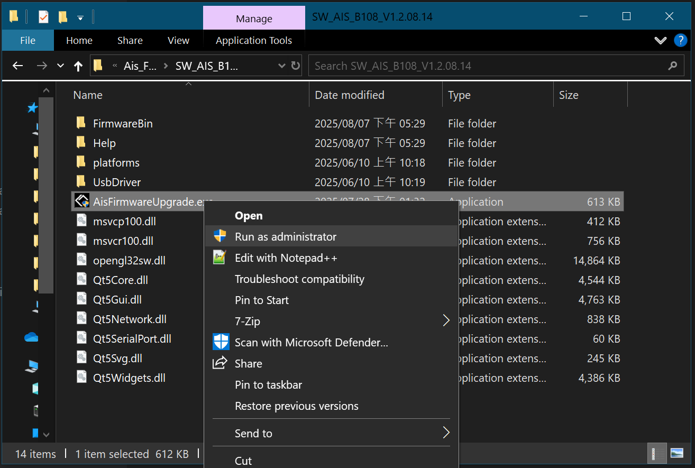
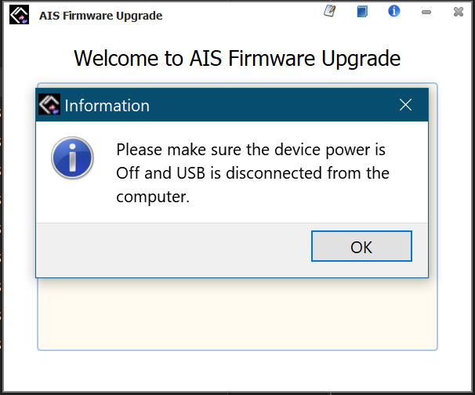
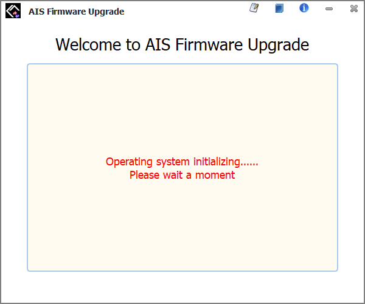
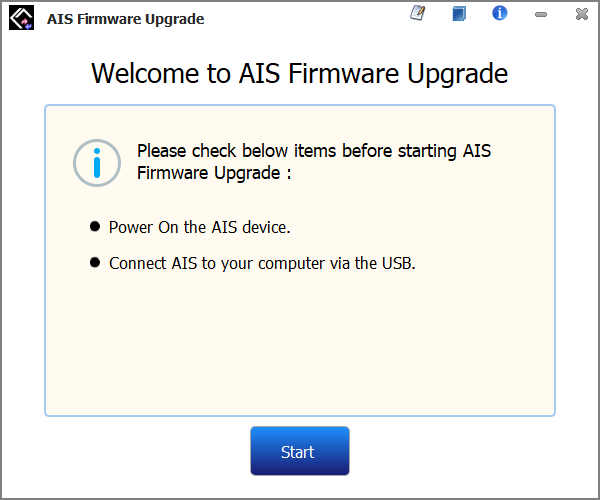
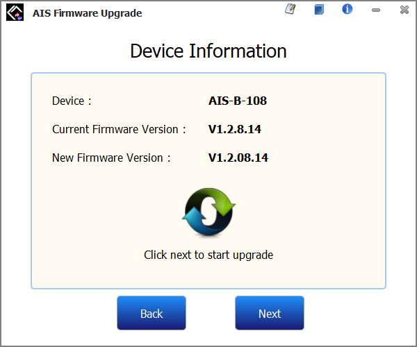
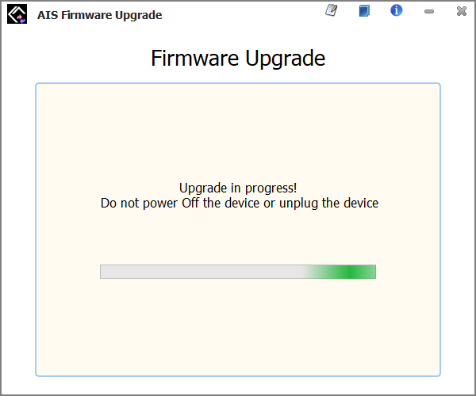
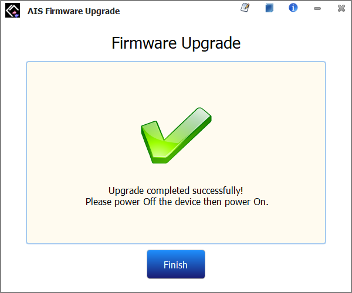

# Firmware Upgrade SOP

## 1, Turn off the power of CAMINO-108 and disconnect the USB port from the PC.

- Turn OFF power to the CAMINO-108 unit. 
- Disconnect the USB cable from the PC. 

## 2, Execute the firmware upgrade application with administrator privileges

- Locate the extracted firmware folder on your PC.
- Right-click AisFirmwareUpgrade.exe and select Run as administrator.

## 3, Make sure the device power is off and the USB is disconnected, then press the "OK" button

- A dialog box will prompt: "Please make sure the device power is Off and USB is disconnected from the computer."
- Verify both conditions, then click OK.

## 4, Wait for initialization

- The utility will display "Operating system initializing... Please wait a moment."
- Allow the program a few seconds to complete initialization. 

## 5, Turn on the device and connect it to the computer via USB, press the "Start" button

-	Power ON the CAMINO-108 unit. 
-	Connect the unit to your PC via the USB cable. 
-	Click Start. 

## 6, Press the "Next" button

- Confirm that the detected Device, Current Firmware Version, and New Firmware Version details are displayed correctly.
- Click Next to begin upgrading. 

## 7, Wait

- The progress bar will indicate installation progress. 
- CAUTION: Do NOT turn off power to the device or disconnect the USB cable during this step. 

## 8, Firmware upgrade complete, press the "Finish" button

- Once the success confirmation screen appears, click Finish.

