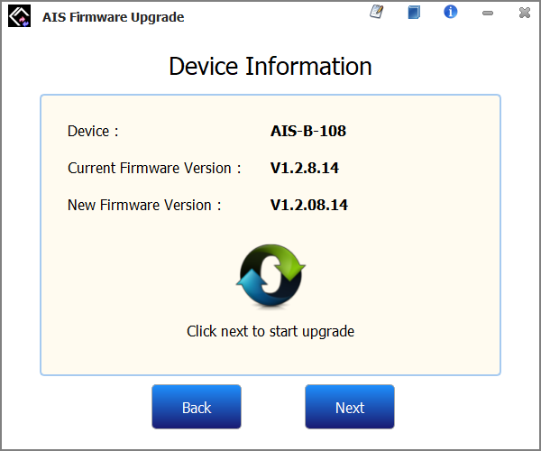

# Firmware Upgrade SOP

## 1, disconnect the CAMINO-108 with PC

## 2, run the firmware upgrade application with administrator privileges

## 3, make sure the device power is off and the USB is disconnected, press the "OK" button

## 4, wait for initialization

## 5, power on the device and connect with the computer via USB, press the "Start" button

## 6, ress "Next" button

## 7, wait

## 8, firmware upgrade complete, press the "Finish" button

